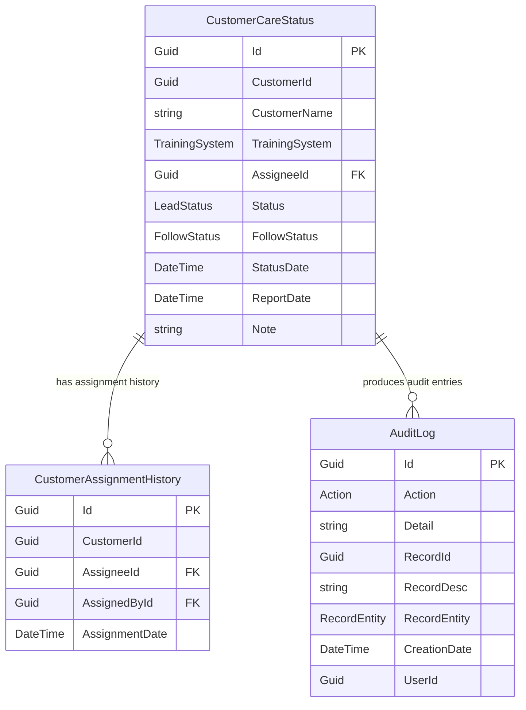
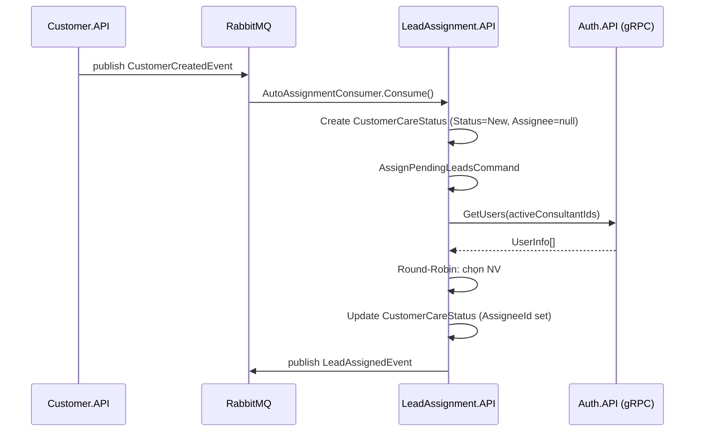
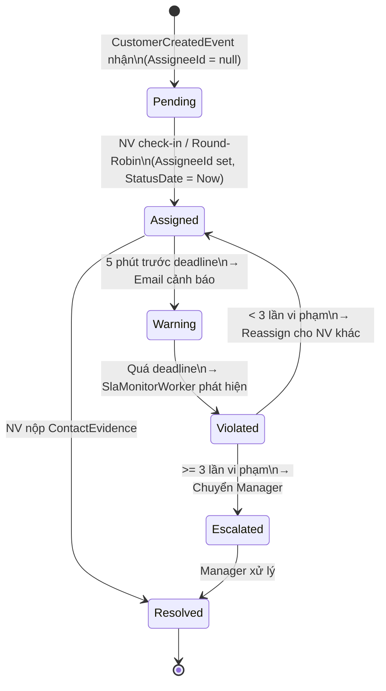

# CrmAdmissions — Hệ Thống CRM Tuyển Sinh / Admissions CRM System

---

## 📋 Mục lục / Table of Contents

- [🇻🇳 Tiếng Việt](#-tiếng-việt)
  - [Tổng quan](#-tổng-quan)
  - [Kiến trúc hệ thống](#️-kiến-trúc-hệ-thống)
  - [Công nghệ sử dụng](#-công-nghệ-sử-dụng)
  - [Cấu trúc dự án](#-cấu-trúc-dự-án)
  - [Hướng dẫn cài đặt](#️-hướng-dẫn-cài-đặt)
  - [Cấu hình](#-cấu-hình)
  - [API Reference](#-api-reference)
  - [Luồng nghiệp vụ](#-luồng-nghiệp-vụ)
  - [Sơ đồ kiến trúc](#-sơ-đồ-kiến-trúc)
  - [Phân quyền](#-phân-quyền)
  - [Roadmap](#️-roadmap)
- [🇬🇧 English](#-english)

---

# 🇻🇳 Tiếng Việt

## 🎯 Tổng quan

**CrmAdmissions** là hệ thống CRM tuyển sinh được xây dựng trên kiến trúc **Microservices** kết hợp **Clean Architecture**, phục vụ 3 nhánh đào tạo:

| Nhánh | Mô tả |
|-------|-------|
| 🎓 **Chính Quy** (Formal) | Quản lý tuyển sinh đào tạo chính quy, tín chỉ |
| 📚 **Ngắn Hạn** (ShortTerm / Sơ cấp) | Quản lý học viên các khóa đào tạo ngắn hạn |
| 🚗 **Lái Xe** (Driving) | Quản lý học viên đào tạo lái xe |

### Vấn đề giải quyết

| Vấn đề | Giải pháp |
|--------|-----------|
| Chia lead thủ công tốn thời gian | **Auto-Assignment Engine** với thuật toán Round-Robin |
| Tư vấn viên bỏ qua lead | **SLA Monitor** — theo dõi từng phút, tự động thu hồi khi quá hạn |
| Lead bị phân công nhiều lần vẫn không xử lý | **3-Strike Escalation** — chuyển lên Manager sau 3 lần vi phạm |
| Giao tiếp giữa services chậm | **gRPC** cho sync calls, **RabbitMQ** cho async events |

---

## 🏗️ Kiến trúc hệ thống

Hệ thống gồm các service độc lập, giao tiếp qua **Event Bus (RabbitMQ)** và **gRPC**:

```
┌─────────────────────────────────────────────────────────┐
│                     API Gateway                         │
│          (YARP Reverse Proxy — port 5000)               │
└──────────┬──────────────────────────────────────────────┘
           │ Routes all requests
  ┌────────▼────────┐        ┌──────────────────────────┐
  │   Auth.API      │        │   LeadAssignment.API     │
  │   /api/auth/*   │◄─gRPC─►│   /api/assignment/*      │
  └─────────────────┘        └──────────────────────────┘
  ┌─────────────────┐  ┌──────────────┐  ┌─────────────┐
  │  Customer.API   │  │  Formal.API  │  │ Driving.API │
  │  /api/customers │  │  /api/formal │  │/api/driving │
  └────────┬────────┘  └──────┬───────┘  └──────┬──────┘
           │                  │                  │
           └──────────────────┴──────────────────┘
                   RabbitMQ (CustomerCreatedEvent)
                   ┌──────────────────┐
                   │  ShortTerm.API   │
                   │  /api/shortterm  │
                   └──────────────────┘
```

### Mô tả từng service

| Service | Port (Dev) | Database | Trách nhiệm |
|---------|-----------|----------|-------------|
| **Auth.API** | 5001 | `AuthDb` | Identity Provider: xác thực JWT, phân quyền Role, quản lý User & Team. Expose gRPC server |
| **Customer.API** | 5005 | `CustomerDb` | Nguồn gốc dữ liệu khách hàng, seed dữ liệu Bogus, publish `CustomerCreatedEvent` |
| **Formal.API** | 5002 | `FormalDb` | Nghiệp vụ tuyển sinh chính quy, consume `CustomerCreatedEvent` |
| **ShortTerm.API** | 5003 | `ShortTermDb` | Nghiệp vụ đào tạo ngắn hạn, consume `CustomerCreatedEvent` |
| **Driving.API** | 5004 | `DrivingDb` | Nghiệp vụ đào tạo lái xe, consume `CustomerCreatedEvent` |
| **LeadAssignment.API** | 5006 | `LeadAssignmentDb` | Engine giao lead tự động, giám sát SLA, lịch sử phân công, báo cáo |
| **ApiGateway** | **5000** | — | YARP Reverse Proxy, JWT validation tại gateway, aggregate Swagger UI |

---

## 🚀 Công nghệ sử dụng

| Công nghệ | Phiên bản | Mục đích |
|-----------|-----------|---------|
| **.NET** (ASP.NET Core Web API) | 8.0 | Runtime và framework chính |
| **Entity Framework Core** | 8.x | ORM, code-first migration với SQL Server |
| **MediatR** | latest | CQRS pattern — tách biệt Commands và Queries |
| **FluentValidation** | latest | Validation cho Commands/Queries |
| **MassTransit** | latest | Message bus abstraction, Outbox Pattern |
| **RabbitMQ** | 3.x | Message broker cho Event-Driven Architecture |
| **gRPC** (Grpc.AspNetCore) | latest | Giao tiếp đồng bộ tốc độ cao giữa các service |
| **YARP** | latest | Reverse proxy cho API Gateway |
| **JWT Bearer** | .NET 8 built-in | Xác thực và phân quyền |
| **Swagger / OpenAPI** | Swashbuckle | Tài liệu API tự động với Enum tiếng Việt |
| **Serilog** | latest | Structured logging |
| **Docker + Docker Compose** | latest | Container hóa infrastructure |
| **Bogus** | latest | Seed dữ liệu giả lập |

---

## 📁 Cấu trúc dự án

```
Admissions-BE/
├── CrmAdmissions.sln
├── docker-compose.yml
├── Directory.Build.props           # Shared MSBuild config
├── run.sh / stop.sh
│
└── src/
    ├── gateway/
    │   └── ApiGateway/             # YARP Reverse Proxy, aggregate Swagger
    │
    ├── services/
    │   ├── Auth/
    │   │   ├── Auth.API/           # Controllers, gRPC Server (GrpcUserService)
    │   │   ├── Auth.Application/   # Features: Login, Register, AssignUser, GetUsers...
    │   │   ├── Auth.Domain/        # User, Team entities; Role, RoleTeam enums
    │   │   └── Auth.Infrastructure/# AuthDbContext, UserRepository, TeamRepository
    │   │
    │   ├── Customer/
    │   │   ├── Customer.API/       # POST /seed-customers
    │   │   ├── Customer.Domain/    # Customer entity (30+ fields), Enums
    │   │   └── Customer.Infrastructure/ # CustomerSeeder (Bogus), CustomerDbContext
    │   │
    │   ├── Formal/ ShortTerm/ Driving/
    │   │   └── [Cấu trúc Clean Architecture giống nhau]
    │   │       # Domain: Customer, Course, CourseParticipant, Payment
    │   │       # Application: Events Consumer, CQRS features
    │   │       # Infrastructure: DbContext, Repositories, Migrations (Outbox)
    │   │
    │   └── LeadAssignment/
    │       ├── LeadAssignment.API/
    │       │   ├── Controllers/AssignmentController.cs  # 15+ endpoints
    │       │   └── Security/SecurityExtensions.cs
    │       ├── LeadAssignment.Application/
    │       │   ├── Assignments/
    │       │   │   ├── Commands/
    │       │   │   │   ├── AssignPendingLeads/     # Round-Robin engine
    │       │   │   │   ├── CheckIn/                # Bật nhận lead
    │       │   │   │   ├── CheckOut/               # Tắt nhận lead
    │       │   │   │   ├── ManualAssign/           # Giao thủ công (Admin)
    │       │   │   │   ├── CreateContactEvidence/  # Nộp bằng chứng liên hệ
    │       │   │   │   └── ReassignAfterSlaViolation/ # Thu hồi & giao lại
    │       │   │   └── Queries/
    │       │   │       ├── GetActiveSla/
    │       │   │       ├── GetAssignmentReport/
    │       │   │       ├── GetCustomerAssignmentHistory/
    │       │   │       ├── GetCustomerCareEvidence/
    │       │   │       ├── GetDashboardSummary/
    │       │   │       └── GetQueueStatus/
    │       │   └── Common/
    │       │       ├── Interfaces/  # IAssignmentDbContext, IUserGrpcClient, IEmailSender
    │       │       └── Models/SlaSettings.cs
    │       ├── LeadAssignment.Domain/
    │       │   ├── Entities/
    │       │   │   ├── CustomerCareStatus.cs       # SLA tracking record
    │       │   │   ├── CustomerAssignmentHistory.cs# Lịch sử phân công
    │       │   │   └── AuditLog.cs                 # Nhật ký hoạt động
    │       │   └── Enums/ Action, AssignmentReason, NotificationType, RecordEntity
    │       └── LeadAssignment.Infrastructure/
    │           ├── Consumers/
    │           │   ├── AutoAssignmentConsumer.cs   # Xử lý CustomerCreatedEvent
    │           │   └── SlaViolationConsumer.cs
    │           ├── Data/AssignmentDbContext.cs      # + MassTransit Outbox tables
    │           ├── Repositories/                    # CustomerCareStatus, AuditLog, History
    │           └── Services/
    │               ├── SlaMonitorWorker.cs          # Background service (mỗi 1 phút)
    │               ├── UserGrpcClient.cs            # gRPC client → Auth.API
    │               └── SmtpEmailSender.cs           # Email notifications
    │
    └── shared/
        ├── Shared.Authentication/   # JwtTokenGenerator, CurrentUserService
        ├── Shared.Common/           # BaseApiController, Result<T>, Behaviors, Middleware
        │   ├── Behaviors/           # LoggingBehavior, PerformanceBehavior, ValidationBehavior
        │   ├── Converters/          # EnumDescriptionJsonConverterFactory
        │   └── Swagger/             # EnumDescriptionSchemaFilter
        ├── Shared.Contracts/        # Integration Events & shared Enums
        │   ├── Events/Auth/         # UserSyncEvent
        │   ├── Events/Customer/     # CustomerCreatedEvent
        │   ├── Events/Lead/         # LeadAssignedEvent
        │   └── Enums/               # TrainingSystem, CourseCategory, Enrollment
        ├── Shared.Logging/          # Serilog setup
        ├── Shared.Messaging/        # IEventBus, RabbitMQ implementation
        └── Shared.Protos/           # .proto definitions for gRPC
```

---

## ⚙️ Hướng dẫn cài đặt

### Yêu cầu hệ thống

- [.NET 8 SDK](https://dotnet.microsoft.com/download/dotnet/8.0)
- [Docker Desktop](https://www.docker.com/products/docker-desktop)
- (Tùy chọn) SQL Server Management Studio hoặc Azure Data Studio

### Bước 1: Clone và khởi động Infrastructure

```bash
git clone <repo-url>
cd Admissions-BE

# Khởi động SQL Server + RabbitMQ bằng Docker
docker-compose up -d sqlserver rabbitmq
```

> 🐇 **RabbitMQ Management UI**: http://localhost:15672 (user: `guest` / pass: `guest`)  
> 🗄️ **SQL Server**: localhost:1433 (sa / Your_Strong_Passw0rd!)

### Bước 2: Chạy EF Migrations

```bash
# Auth Service
dotnet ef database update \
  --project src/services/Auth/Auth.Infrastructure \
  --startup-project src/services/Auth/Auth.API

# Customer Service
dotnet ef database update \
  --project src/services/Customer/Customer.Infrastructure \
  --startup-project src/services/Customer/Customer.API

# Formal Service
dotnet ef database update \
  --project src/services/Formal/Formal.Infrastructure \
  --startup-project src/services/Formal/Formal.API

# ShortTerm Service
dotnet ef database update \
  --project src/services/ShortTerm/ShortTerm.Infrastructure \
  --startup-project src/services/ShortTerm/ShortTerm.API

# Driving Service
dotnet ef database update \
  --project src/services/Driving/Driving.Infrastructure \
  --startup-project src/services/Driving/Driving.API

# LeadAssignment (có Outbox tables riêng)
dotnet ef database update \
  --project src/services/LeadAssignment/LeadAssignment.Infrastructure \
  --startup-project src/services/LeadAssignment/LeadAssignment.API \
  --context AssignmentDbContext
```

### Bước 3: Cấu hình SLA Managers

Mở `src/services/LeadAssignment/LeadAssignment.API/appsettings.json` và cập nhật các GUID Manager thực tế sau khi đã tạo tài khoản trong Auth:

```json
"SlaSettings": {
  "SlaDeadlineMinutes": 30,
  "DefaultManagerId": "guid-of-default-manager",
  "Managers": {
    "ShortTerm": "guid-of-shortterm-manager",
    "Formal":    "guid-of-formal-manager",
    "Driving":   "guid-of-driving-manager"
  }
}
```

### Bước 4: Khởi động các Services

```bash
# Option A: Chạy từng service riêng lẻ (hot reload)
dotnet watch run --project src/services/Auth/Auth.API
dotnet watch run --project src/services/Customer/Customer.API
dotnet watch run --project src/services/Formal/Formal.API
dotnet watch run --project src/services/ShortTerm/ShortTerm.API
dotnet watch run --project src/services/Driving/Driving.API
dotnet watch run --project src/services/LeadAssignment/LeadAssignment.API
dotnet watch run --project src/gateway/ApiGateway

# Option B: Dùng script sẵn có
bash run.sh
```

### Bước 5: Kiểm tra hoạt động

| URL | Mô tả |
|-----|-------|
| http://localhost:5000/swagger | 🔗 Aggregate Swagger UI (tất cả APIs qua Gateway) |
| http://localhost:5001/swagger | Auth API Swagger (direct) |
| http://localhost:5006/api/assignment/swagger | LeadAssignment API Swagger (direct) |
| http://localhost:15672 | RabbitMQ Management UI |

---

## 🔧 Cấu hình

### SLA Settings

File: `src/services/LeadAssignment/LeadAssignment.API/appsettings.json`

```json
{
  "SlaSettings": {
    "SlaDeadlineMinutes": 30,
    "AdminSlaDeadlineMinutes": 120,
    "MaxSlaMultiplier": 4,
    "DefaultManagerId": "00000000-0000-0000-0000-000000000000",
    "Managers": {
      "ShortTerm": "guid-shortterm-manager",
      "Formal":    "guid-formal-manager",
      "Driving":   "guid-driving-manager"
    }
  }
}
```

| Key | Ý nghĩa |
|-----|---------|
| `SlaDeadlineMinutes` | Thời gian (phút) tối đa để tư vấn viên liên hệ khách sau khi nhận lead |
| `AdminSlaDeadlineMinutes` | Thời gian SLA mở rộng dành cho Admin/Manager |
| `MaxSlaMultiplier` | Hệ số nhân SLA tối đa (dự phòng mở rộng về sau) |
| `DefaultManagerId` | Manager fallback khi không tìm được manager của nhánh |
| `Managers.{Branch}` | GUID Manager theo từng nhánh đào tạo |

### JWT / Authentication

```json
{
  "AppSettings": {
    "AccessToken": "Your_Secret_Key_Needs_To_Be_At_Least_64_Characters_Long!"
  },
  "JwtOptions": {
    "Issuer": "http://localhost:5001",
    "Audience": "CrmAdmissions",
    "Secret": "Your_Secret_Key_Needs_To_Be_At_Least_64_Characters_Long!",
    "ExpiryMinutes": 60
  }
}
```

> ⚠️ **Lưu ý bảo mật**: Không commit secret key thực tế vào git. Dùng [User Secrets](https://learn.microsoft.com/en-us/aspnet/core/security/app-secrets) hoặc biến môi trường trong production.

---

## 📡 API Reference

> Tất cả endpoint được expose qua **API Gateway** tại `http://localhost:5000`.

### 🔐 Auth API — `/api/auth`

| Method | Endpoint | Auth | Mô tả |
|--------|----------|------|-------|
| `POST` | `/api/auth/register` | ❌ Public | Đăng ký tài khoản mới |
| `POST` | `/api/auth/login` | ❌ Public | Đăng nhập, trả về JWT token |
| `GET` | `/api/auth/profile` | ✅ Bearer | Lấy thông tin cá nhân của người đang đăng nhập |
| `GET` | `/api/auth/users` | ✅ Bearer | Danh sách toàn bộ người dùng |
| `GET` | `/api/auth/users/{id}` | ✅ Bearer | Thông tin người dùng theo GUID |
| `GET` | `/api/auth/teams` | ✅ **Admin** | Danh sách toàn bộ Teams |
| `POST` | `/api/auth/assign-user` | ✅ **Admin** | Cấp Role / gán người dùng vào Team |
| `POST` | `/api/auth/remove-team` | ✅ **Admin** | Gỡ người dùng khỏi Team |

---

### 👥 Customer API — `/api/customers`

| Method | Endpoint | Auth | Mô tả |
|--------|----------|------|-------|
| `POST` | `/api/customers/seed-customers?count=100` | ✅ Bearer | Seed `count` khách hàng giả lập (Bogus), broadcast `CustomerCreatedEvent` |

> Mỗi customer được seed sẽ kích hoạt toàn bộ luồng: Formal/ShortTerm/Driving nhận event + LeadAssignment Auto-Assignment Engine.

---

### 📋 LeadAssignment API — `/api/assignment`

#### Trạng thái Tư vấn viên

| Method | Endpoint | Auth | Mô tả |
|--------|----------|------|-------|
| `POST` | `/api/assignment/check-in?trainingSystem={n}` | ✅ Bearer | Bật nhận lead. `n`: 1=Sơ cấp, 2=Chính quy, 3=Lái xe |
| `POST` | `/api/assignment/check-out` | ✅ Bearer | Tắt nhận lead (nghỉ làm) |

#### Phân công Lead

| Method | Endpoint | Auth | Mô tả |
|--------|----------|------|-------|
| `POST` | `/api/assignment/manual-assign` | ✅ **Admin** | Giao thủ công lead cho tư vấn viên cụ thể |
| `POST` | `/api/assignment/evidence` | ✅ Bearer | Nộp bằng chứng đã liên hệ khách hàng |
| `GET` | `/api/assignment/evidence/{customerId}` | ✅ Bearer | Xem bằng chứng liên hệ của 1 khách hàng |

#### Xem thông tin & Báo cáo

| Method | Endpoint | Auth | Mô tả |
|--------|----------|------|-------|
| `GET` | `/api/assignment/sla/active` | ✅ **Admin** | Tất cả lead đang được track SLA toàn hệ thống |
| `GET` | `/api/assignment/sla/me` | ✅ Bearer | Lead đang được giao cho tôi |
| `GET` | `/api/assignment/queue` | ✅ **Admin** | Trạng thái queue toàn hệ thống |
| `GET` | `/api/assignment/queue/me` | ✅ Bearer | Queue cá nhân của tư vấn viên |
| `GET` | `/api/assignment/history/{customerId}` | ✅ **Admin** | Lịch sử phân công của 1 khách hàng |
| `GET` | `/api/assignment/report` | ✅ **Admin** | Báo cáo hiệu suất chăm sóc khách hàng |
| `GET` | `/api/assignment/dashboard-summary` | ✅ **Admin** | Thống kê tổng quan dashboard |

#### Danh mục

| Method | Endpoint | Auth | Mô tả |
|--------|----------|------|-------|
| `GET` | `/api/assignment/follow-status` | ❌ Public | Danh sách giá trị FollowStatus |
| `GET` | `/api/assignment/lead-status` | ❌ Public | Danh sách giá trị LeadStatus |

**Ví dụ body — Manual Assign:**
```json
{
  "customerId": "3fa85f64-5717-4562-b3fc-2c963f66afa6",
  "assigneeId": "a1b2c3d4-e5f6-7890-abcd-ef1234567890"
}
```

**Ví dụ body — Contact Evidence:**
```json
{
  "customerId": "3fa85f64-5717-4562-b3fc-2c963f66afa6",
  "note": "Đã gọi điện, hẹn tư vấn trực tiếp ngày 15/08",
  "followStatus": 1
}
```

---

## 🔄 Luồng nghiệp vụ

### Luồng 1: Tạo và Giao Lead Tự động

```
POST /api/customers/seed-customers?count=50
        │
        ▼ Seed 50 customers vào CustomerDb
        ▼ Publish CustomerCreatedEvent × 50 (Outbox Pattern)
        │
        ├──► [Formal.API]    → CustomerCreatedEvent → lưu vào FormalDb
        ├──► [ShortTerm.API] → CustomerCreatedEvent → lưu vào ShortTermDb
        ├──► [Driving.API]   → CustomerCreatedEvent → lưu vào DrivingDb
        │
        └──► [LeadAssignment.API] AutoAssignmentConsumer
                    │
                    ▼ Tạo CustomerCareStatus
                      { Status=New, AssigneeId=null, StatusDate=Now }
                    │
                    ▼ Gọi AssignPendingLeadsCommand
                      (TrainingSystem = event.TrainingSystem)
                    │
                   [Có NV check-in cho nhánh này?]
                   │
                   ├── CÓ → Round-Robin chọn NV ít assignment nhất
                   │         CustomerCareStatus.AssigneeId = NV.Id
                   │         CustomerCareStatus.StatusDate = Now (SLA bắt đầu)
                   │         Ghi CustomerAssignmentHistory
                   │         Publish LeadAssignedEvent
                   │
                   └── KHÔNG → Lead ở Pending (AssigneeId=null)
                               Sẽ được gán khi có NV gọi check-in
```

### Luồng 2: Giám sát SLA & Thu hồi Lead

```
SlaMonitorWorker — chạy mỗi 1 phút (BackgroundService)
        │
        ▼ Query CustomerCareStatus:
          WHERE Status = 'New' AND AssigneeId IS NOT NULL
        │
        ├── [5 phút trước deadline — SLA Warning]
        │       → Ghi AuditLog: [SLA_WARNING_SENT] cho CustomerId
        │       → Gửi email cảnh báo đến email của tư vấn viên (qua gRPC → Auth)
        │
        └── [Đã qua deadline — SLA Violation]
                │
                ▼ ReassignAfterSlaViolationCommand
                │
                ▼ Đếm số lần vi phạm qua CustomerAssignmentHistory
                │
                ├── Vi phạm < 3 lần:
                │   → Tìm NV active (Check-in trong 10 ngày qua)
                │   → Loại NV đã từng nhận KH này (pastAssigneeIds)
                │   → Round-Robin: chọn NV có ngày assignment CŨ NHẤT
                │   → Update CustomerCareStatus (assignee mới, StatusDate=Now)
                │   → Ghi CustomerAssignmentHistory
                │   → Ghi AuditLog: "SLA Violation: Thu hồi KH..."
                │   → Publish LeadAssignedEvent (reason=SlaViolation)
                │   → Email: báo NV cũ đã bị thu hồi
                │   → Email: báo NV mới được giao
                │
                └── Vi phạm >= 3 lần (Escalation):
                    → Chuyển lead lên Manager của nhánh (từ SlaSettings)
                    → Gửi email escalation cho Manager
                    → Nếu không có Manager → giữ Unassigned, log warning
```

### Luồng 3: Đồng bộ User qua gRPC

```
[Auth.API] User đăng ký hoặc được gán role mới
        │
        ▼ Publish UserSyncEvent qua RabbitMQ
        │
        └──► [LeadAssignment.API]
                → Lưu bản sao User vào LeadAssignmentDb (replica)
                → Dùng cho tra cứu nội bộ mà không cần call chéo

[LeadAssignment] Cần thông tin User thời gian thực (tên, email):
        → gRPC call tới Auth.API/GrpcUserService
        → Trả về UserInfo { FullName, Email, Role, TeamId }
        → Dùng trong SLA violation emails và Round-Robin selection
```

---

## 📊 Sơ đồ kiến trúc

### Domain Model — LeadAssignment Service



### Sequence Diagram — Lead Assignment



### Vòng đời trạng thái Lead



---

## 👥 Phân quyền

| Role | Giá trị | Mô tả | Quyền chính |
|------|---------|-------|-------------|
| **Admin** | 99 | Quản trị viên | Toàn quyền: user management, manual assign, báo cáo, dashboard |
| **User** | 1 | Tư vấn viên | Check-in/out, xem lead của mình, nộp bằng chứng liên hệ |
| **Intern** | 2 | Thực tập sinh / Thử việc | Quyền hạn chế (theo business rule) |
| **EntryClerk** | 3 | Nhân viên nhập liệu | Nhập liệu dữ liệu khách hàng |
| **Marketing** | 4 | Marketing | Xem thông tin lead |

> **Phân quyền theo nhánh đào tạo** dùng `RoleTeam` claim trong JWT:
>
> | RoleTeam | Nhánh |
> |----------|-------|
> | `4` | Ngắn hạn (ShortTerm / Sơ cấp) |
> | `5` | Chính quy (Formal) |
> | `6` | Lái xe (Driving) |

---

## 🗺️ Roadmap

- [ ] **Zalo OA Integration**: Gửi thông báo Zalo khi gán lead thành công hoặc khi quá hạn SLA
- [ ] **Account Lock**: Cấu hình khóa/cảnh báo tài khoản tư vấn viên vi phạm SLA ≥ 3 lần
- [ ] **Dashboard UI**: Frontend dashboard tương tác với API Gateway
- [ ] **Business APIs**: Hoàn thiện API cho Formal, ShortTerm, Driving (quản lý Course, CourseParticipant, Payment)
- [ ] **Conversion Tracking**: Thêm service theo dõi tỉ lệ chuyển đổi và báo cáo nâng cao

---

---

# 🇬🇧 English

## Overview

**CrmAdmissions** is an admissions CRM system built on **Microservices + Clean Architecture**, serving three training branches:

- 🎓 **Formal** — Degree/credit-based training admissions
- 📚 **ShortTerm** — Short-term course admissions
- 🚗 **Driving** — Driving license training admissions

### Key Features

| Problem | Solution |
|---------|---------|
| Manual lead distribution is slow | **Auto-Assignment Engine** with Round-Robin algorithm |
| Consultants ignoring assigned leads | **SLA Monitor** — checks every minute, auto-recalls overdue leads |
| Repeat SLA violations on same lead | **3-Strike Escalation** — escalates to branch Manager after 3 violations |
| Slow inter-service communication | **gRPC** for sync calls, **RabbitMQ** for async events |

---

## Architecture

| Service | Port | Database | Responsibility |
|---------|------|----------|---------------|
| **Auth.API** | 5001 | AuthDb | Identity Provider: JWT auth, Role-based authorization, User/Team management, gRPC server |
| **Customer.API** | 5005 | CustomerDb | Lead source of truth, Bogus data seeding, publishes `CustomerCreatedEvent` |
| **Formal.API** | 5002 | FormalDb | Formal training domain logic, consumes `CustomerCreatedEvent` |
| **ShortTerm.API** | 5003 | ShortTermDb | Short-term training domain logic |
| **Driving.API** | 5004 | DrivingDb | Driving training domain logic |
| **LeadAssignment.API** | 5006 | LeadAssignmentDb | Auto-assignment engine, SLA monitoring, assignment history, reporting |
| **ApiGateway** | 5000 | — | YARP reverse proxy, JWT validation, aggregated Swagger UI |

---

## Tech Stack

| Technology | Purpose |
|-----------|---------|
| **.NET 8** ASP.NET Core Web API | Core runtime & framework |
| **Entity Framework Core 8** | ORM, code-first migrations |
| **MediatR** | CQRS — Commands/Queries separation |
| **MassTransit + RabbitMQ** | Async messaging + Transactional Outbox Pattern |
| **gRPC** | High-speed sync inter-service communication |
| **YARP** | API Gateway reverse proxy |
| **JWT Bearer** | Authentication & role-based authorization |
| **Bogus** | Fake data generation for seeding |
| **Docker + Docker Compose** | Infrastructure containerization |

---

## Quick Start

### Prerequisites
- [.NET 8 SDK](https://dotnet.microsoft.com/download/dotnet/8.0)
- [Docker Desktop](https://www.docker.com/products/docker-desktop)

### 1. Start Infrastructure

```bash
docker-compose up -d sqlserver rabbitmq
```

### 2. Run Database Migrations

```bash
dotnet ef database update --project src/services/Auth/Auth.Infrastructure --startup-project src/services/Auth/Auth.API
dotnet ef database update --project src/services/Customer/Customer.Infrastructure --startup-project src/services/Customer/Customer.API
dotnet ef database update --project src/services/LeadAssignment/LeadAssignment.Infrastructure --startup-project src/services/LeadAssignment/LeadAssignment.API --context AssignmentDbContext
# Repeat for Formal, ShortTerm, Driving...
```

### 3. Start Services

```bash
bash run.sh
```

### 4. Access

| URL | Description |
|-----|-------------|
| http://localhost:5000/swagger | Aggregated Swagger UI (all APIs) |
| http://localhost:15672 | RabbitMQ Management UI |

---

## Key Business Flows

### Lead Auto-Assignment

1. `POST /api/customers/seed-customers?count=N` → seeds N customers, broadcasts `CustomerCreatedEvent`
2. **LeadAssignment** `AutoAssignmentConsumer` receives event → creates `CustomerCareStatus` (Pending, no assignee)
3. `AssignPendingLeadsCommand` runs Round-Robin to find a checked-in consultant for the right training branch
4. If found → lead assigned, SLA timer starts; otherwise → remains Pending until a consultant checks in

### SLA Monitoring & Reassignment

1. `SlaMonitorWorker` runs every 1 minute as a `BackgroundService`
2. **Warning** (5 min before deadline): logs `SLA_WARNING_SENT` to AuditLog, sends warning email via SMTP
3. **Violation** (past deadline):
   - `< 3 violations`: reassigns to next active consultant (Round-Robin, excluding past assignees for this customer)
   - `≥ 3 violations`: escalates to branch Manager, sends escalation email

### gRPC User Sync

- `Auth.API` publishes `UserSyncEvent` on user changes → `LeadAssignment` stores a local User replica
- For real-time user info (name, email) → `LeadAssignment` calls `Auth.API` via gRPC (`GetUsers` batch call)

---

## API Reference

### Auth — `POST /api/auth/login`

```json
// Request
{ "userName": "admin", "password": "P@ssword123" }

// Response
{
  "data": {
    "accessToken": "eyJhbGci...",
    "userId": "guid",
    "fullName": "Admin User",
    "role": "Admin"
  }
}
```

### Seed Customers — `POST /api/customers/seed-customers?count=50`

Seeds 50 realistic fake customers and triggers the full assignment pipeline.

### Check-In — `POST /api/assignment/check-in?trainingSystem=1`

| Value | Branch |
|-------|--------|
| `1` | ShortTerm (Sơ cấp) |
| `2` | Formal (Chính quy) |
| `3` | Driving (Lái xe) |

### Contact Evidence — `POST /api/assignment/evidence`

```json
{
  "customerId": "guid",
  "note": "Called customer, scheduled consultation",
  "followStatus": 1
}
```

---

## Roles & Permissions

| Role | Value | Permissions |
|------|-------|-------------|
| **Admin** | 99 | Full: user management, manual assign, all reports & dashboard |
| **User** | 1 | Consultant: check-in/out, view own leads, submit contact evidence |
| **Intern** | 2 | Intern / Probation |
| **EntryClerk** | 3 | Data entry |
| **Marketing** | 4 | Marketing |

> Branch-level permissions via `RoleTeam` JWT claim: `4`=ShortTerm, `5`=Formal, `6`=Driving

---

## Configuration Reference

### SLA Settings

```json
{
  "SlaSettings": {
    "SlaDeadlineMinutes": 30,        // Max minutes for consultant to contact lead
    "AdminSlaDeadlineMinutes": 120,  // Extended SLA for managers
    "MaxSlaMultiplier": 4,           // Max SLA extension multiplier
    "DefaultManagerId": "guid",      // Fallback manager GUID
    "Managers": {
      "ShortTerm": "guid",           // ShortTerm branch manager
      "Formal":    "guid",           // Formal branch manager
      "Driving":   "guid"            // Driving branch manager
    }
  },
  "GrpcConfig": {
    "AuthServiceUrl": "http://localhost:5001"
  }
}
```

---

## Roadmap

- [ ] Zalo OA notifications for lead assignment and SLA breaches
- [ ] Auto-lock accounts for consultants with ≥ 3 SLA violations
- [ ] Interactive Dashboard UI
- [ ] Complete Formal/ShortTerm/Driving APIs (Course, Payment management)
- [ ] Conversion rate tracking service
